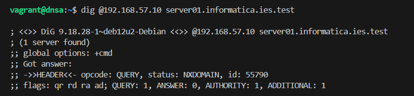
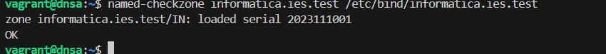
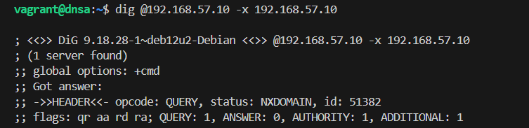
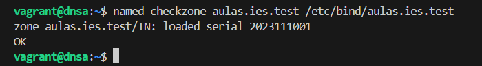
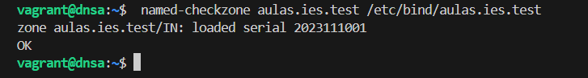

# Ejercicio 1
La creación del dominio ies.test queda reflejada en los archivos [named.conf.local](./DNSA_config/named.conf.local) y [ies.test.dns](./DNSA_config/ies.test.dns).

# Ejercicio 2
De nuevo, queda reflejado en los archivos anteriores.

# Ejercicio 3

# Ejercicio 4

# Ejercicio 5

# Ejercicio 6
He realizado toda la configuración en el archivo [named.conf.local DNSA](./DNSA_config/named.conf.local) de DNSA y en [named.conf.local DNSB](./DNSB_config/named.conf.local), pero no he conseguido que funcione correctamente.

# Ejercicio 7

# Ejercicio 8
Los logs de consultas nos pueden ayudar en varios ámbitos, pero destacan: diagnóstico de problemas, seguridad y monitorización.
Se debe tener cuidado con la protección de datos personales, asegurándose de que se eliminen después de un tiempo razonable.